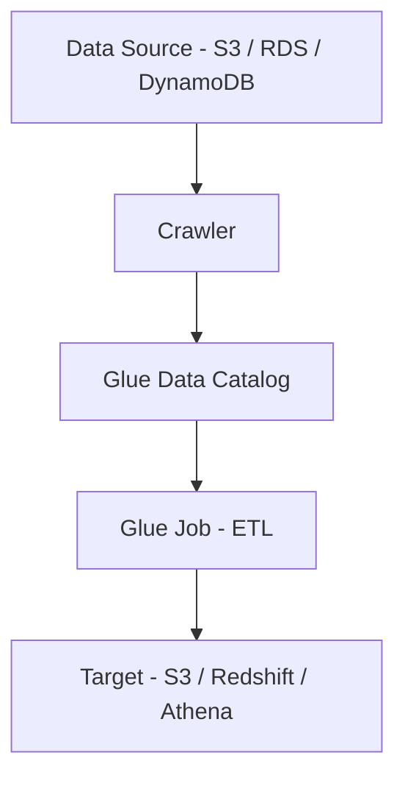

# AWS Glue 

## What is AWS Glue?
AWS Glue is a **serverless ETL (Extract, Transform, Load) service** provided by AWS.  
It helps in discovering, preparing, transforming, and loading data for analytics and reporting without managing infrastructure.

---

## Why AWS Glue?
- To process and clean raw data
- To build automated ETL pipelines
- To avoid server and cluster management
- To handle large-scale batch data processing

---

## Where AWS Glue is Used
- Data Warehousing
- Data Analytics
- Data Lakes
- Batch ETL pipelines
- Business Intelligence (BI) reporting

---

## AWS Glue Workflow

---

##  Key Components

### 1. Glue Crawler
- Automatically scans data sources
- Detects schema and data format
- Creates tables in Data Catalog

### 2. Glue Data Catalog
- Central metadata repository
- Stores table definitions and schema
- Used by Athena, Redshift, and EMR

### 3. Glue Job
- Performs ETL operations
- Uses Apache Spark
- Supports Python (PySpark) and Scala

### 4. Glue Trigger
- Schedules Glue jobs
- Time-based or event-based execution

---
## AWS Glue Architecture Diagram

---

## Advantages
- Fully serverless
- Automatic scaling
- Pay-as-you-go pricing
- Handles large datasets (GBs–TBs)
- Easy AWS service integration

---

## Disadvantages
- Not suitable for real-time processing
- Requires Spark knowledge
- Overkill for small datasets
- Debugging can be complex

---

## Best Practices
- Store data in partitioned format (S3)
- Run crawlers only when schema changes
- Use job bookmarks to avoid reprocessing
- Separate raw and processed data
- Optimize Spark configurations

---

## Common Use Cases
- Cleaning raw log data
- Preparing data for analytics
- Loading data into Redshift
- Building data lakes on Amazon S3

---

