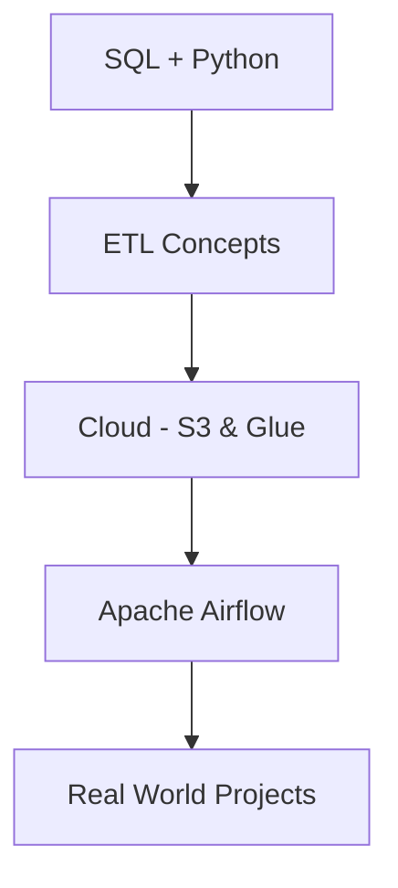

# Introduction to Data Engineering (Beginner Guide)

##  Overview
Data Engineering is the backbone of modern data-driven systems.  
It focuses on collecting, cleaning, transforming, and storing raw data so that it can be easily used for analytics, reporting, and machine learning.

Without data engineering, data is messy, unreliable, and difficult to use.

---

## What is Data Engineering?
**Data Engineering** is the process of building systems and pipelines that prepare raw data for analysis.

In simple words:
> Data Engineers make data usable.

They ensure data is:
- Clean  
- Structured  
- Reliable  
- Scalable  

---

## Simple Analogy
Think of data like ingredients in a kitchen:
- Raw data → Unclean ingredients  
- Data Engineer → Kitchen manager  
- Data Analyst / Scientist → Chef  

If ingredients are not prepared properly, the chef cannot cook.

---

## What Does a Data Engineer Do?
- Collect data from APIs, databases, files, logs
- Build **ETL pipelines** (Extract, Transform, Load)
- Store data in **Data Lakes** and **Data Warehouses**
- Maintain data quality and security
- Monitor and optimize data pipelines

---

## Data Engineering Lifecycle
1. Data Collection  
2. Data Storage (S3, Databases)  
3. Data Cleaning & Processing  
4. Data Integration  
5. Data Quality & Governance  
6. Data Available for Analysis  

---

## Data Engineering vs Other Roles

| Role | Responsibility |
|-----|---------------|
| Data Engineer | Builds data pipelines & infrastructure |
| Data Analyst | Creates reports & dashboards |
| Data Scientist | Builds ML models & predictions |

---

## Core Skills Required

### Technical Skills
- SQL (Must-have)
- Python (ETL & scripting)
- Databases (SQL & NoSQL)
- ETL / ELT concepts
- Cloud platforms (AWS / GCP / Azure)

### Non-Technical Skills
- Problem-solving
- Debugging mindset
- Attention to detail
- Communication

---

## Common Tools & Technologies

### Storage
- Amazon S3
- HDFS

### Processing
- Pandas
- Apache Spark

### ETL & Orchestration
- AWS Glue
- Apache Airflow

### Data Warehousing
- Amazon Redshift
- Google BigQuery
- Snowflake

### Streaming (Advanced)
- Apache Kafka

### Version Control
- Git & GitHub

---

## Beginner Roadmap

---

## Why Data Engineering Matters
- Powers recommendations (Netflix, Amazon)
- Enables real-time analytics
- Supports AI & Machine Learning
- Used in every industry

Clean data = Better decisions.

---

## Who Can Become a Data Engineer?
- Freshers
- Career switchers
- Non-technical backgrounds
- Anyone willing to learn

---

## Final conclusion
Data Engineering is not just about coding.  
It is about **designing systems, solving problems, and building strong foundations**.

> If data is the new oil,  
> **Data Engineers are the pipelines.**

---

## Video Reference

Watch the full video here:  
 https://youtu.be/hf2go3E2m8g

 Click to watch the video

**Topics covered in the video include:**  
- What is Data Engineering?  
- Data Engineering Lifecycle  
- ETL & Data Pipelines  
- Databases & Storage  
- Cloud & AWS Services  
- Data Architecture & Tools  

