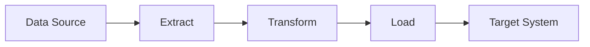

# ETL (Extract, Transform, Load)

## Introduction
ETL stands for **Extract, Transform, Load**.  
It is a data pipeline process used to collect data from different sources, process and clean it, and then store it in a target system for analysis and reporting.
ETL is widely used in **Data Engineering, Analytics, and Business Intelligence**.

---

## ETL Workflow

---

##  Extract
Extraction is the first step where data is collected from various sources.

### Common Data Sources:
- Databases (MySQL, PostgreSQL)
- APIs
- CSV / Excel files
- Application logs
- Cloud storage (AWS S3, Google Cloud Storage)

**Example:**  
Extract order data from a MySQL database or user data from an API.

---

##  Transform
Transformation is the process of cleaning, modifying, and preparing data for analysis.

### Common Transformations:
- Remove null or duplicate values
- Change data types
- Rename columns
- Filter required records
- Aggregate data (sum, average, count)
- Validate data

**Example:**  
Convert date format, calculate total sales, remove duplicate users.

---

## Load
In the Load step, the transformed data is stored in a target system.

### Target Systems:
- Data Warehouse (Amazon Redshift, BigQuery)
- Databases (PostgreSQL, MySQL)
- Data Lakes (AWS S3)
- Analytics tools

**Example:**  
Load cleaned sales data into a data warehouse for reporting.

---

## Why ETL is Needed
- Data comes from multiple sources
- Raw data is unstructured and inconsistent
- Direct analysis on raw data is difficult

ETL helps to:
- Centralize data
- Improve data quality
- Enable analytics and reporting
- Support business decision-making

---

## ETL Use Cases

### E-commerce
- Extract orders, users, and payment data
- Transform data for consistency
- Load into a data warehouse for sales analysis

### Banking
- Process transaction and customer data
- Generate reports and detect fraud

### Application Monitoring
- Analyze application logs
- Monitor performance and errors

### Business Intelligence
- Combine multiple data sources
- Create dashboards and reports

---

## ETL Tools
### Cloud Tools:
- AWS Glue
- Azure Data Factory
- Google Dataflow

### Open Source Tools:
- Apache Airflow
- Apache Spark
- Talend

### Python-based ETL:
- Pandas
- NumPy
- SQLAlchemy

---

##  Advantages of ETL
- Improves data quality
- Centralized data storage
- Supports automation
- Enables fast and accurate analytics
- Scalable for large datasets

---

## Disadvantages of ETL
- Initial setup can be complex
- Higher cost for cloud services
- Processing large data takes time
- Not suitable for real-time processing
- Requires maintenance

---

## ETL vs ELT
| ETL | ELT |
|----|----|
| Transform before loading | Transform after loading |
| Slower processing | Faster processing |
| Traditional approach | Modern cloud approach |

---

## Conclusion
ETL is a critical process in data engineering that ensures data is clean, consistent, and ready for analysis. It plays a key role in analytics, reporting, and decision-making systems.

--- 
