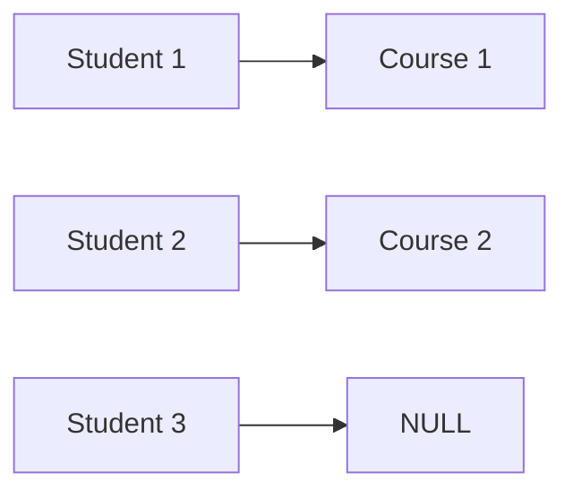
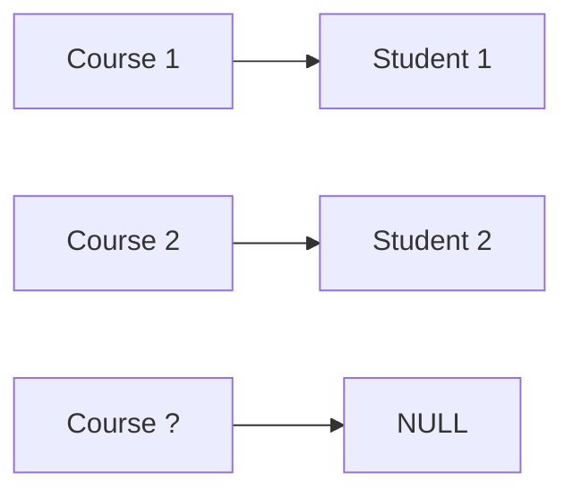

# MySQL Basics 

This document covers **basic MySQL concepts** including Database, Query, Table creation, joins and common SQL operations.

---

## What is a Database?

A **database** is an organized collection of data that is stored electronically and can be easily accessed, managed, and updated.

### Examples:

* Student records
* Bank details
* User login information

---

## What is DBMS?

DBMS (Database Management System) is a software system used to create, store, manage, and retrieve data from a database efficiently.

## Difference Between Relational and Non-Relational Databases

| Feature              | Relational Database (RDBMS)                | Non-Relational Database (NoSQL)                           |
| -------------------- | ------------------------------------------ | --------------------------------------------------------- |
| **Data Structure**   | Data stored in **tables (rows & columns)** | Data stored as documents, key-value, column, or graph     |
| **Schema**           | **Fixed schema** (predefined structure)    | Flexible-dynamic schema                                   |
| **Relationships**    | Uses **primary key & foreign key**         | No strict relationships                                   |
| **Query Language**   | Uses **SQL**                               | Uses NoSQL queries / APIs                                 |
| **Scalability**      | **Vertical scaling** (increase CPU/RAM)    | Horizontal scaling (add servers)                          |
| **Transactions**     | Supports **ACID properties**               | Mostly follows BASE model                                 |
| **Data Consistency** | Strong consistency                         | Eventual consistency                                      |
| **Complex Queries**  | Very good for complex joins                | Limited or no joins                                       |
| **Performance**      | Slower for huge distributed data           | Faster for large-scale data                               |
| **Best For**         | Structured data                            | Semi-structured / unstructured data                       |


## What is MySQL?

MySQL is an **open-source Relational Database Management System (RDBMS)** that uses **SQL (Structured Query Language)** to manage data stored in tables.

---

##  What is a Query?

A **query** is a request or command given to the database to **read, insert, update, or delete data**.

### Example:

```sql
SELECT * FROM students;
```

---

## MySQL Data Types

### 1. INT

* Used to store **whole numbers** (integers).
* Commonly used for IDs, age, count, etc.

**Example:**

```sql
age INT
```

### 2. VARCHAR

* Used to store **text or string values**.
* Stores variable-length characters, which saves memory.
* Mostly used for names, emails, course names, etc.

**Example:**

```sql
name VARCHAR(50)
```

### 3. ENUM

* Used when a column should have **only one value from a fixed list**.
* Helps maintain data consistency.

**Example:**

```sql
gender ENUM('Male', 'Female', 'Other')
```

### 4. DATE

* Used to store **date only** (without time).
* Format: `YYYY-MM-DD`

**Example:**

```sql
dob DATE
```

### 5. TIMESTAMP

* Used to store **date and time**.
* Automatically stores the current date and time when a record is created or updated.

**Example:**

```sql
created_at TIMESTAMP
```

### 6. BOOLEAN

* Used to store **true or false values**.
* Internally stored as `TINYINT` (1 = true, 0 = false).

**Example:**

```sql
is_active BOOLEAN
```

#### Example Table Using All Data Types

```sql
CREATE TABLE users (
    id INT AUTO_INCREMENT PRIMARY KEY,
    name VARCHAR(50),
    gender ENUM('Male', 'Female', 'Other'),
    dob DATE,
    created_at TIMESTAMP,
    is_active BOOLEAN
);
```
---

## What are Constraints?

Constraints are rules that restrict the type of data that can be stored in a database table. They help prevent invalid data from being inserted.


## Different types Constraints 

| Constraint     | Description                                                 | Key Points                                          | Example                               |
| -------------- | ----------------------------------------------------------- | --------------------------------------------------- | ------------------------------------- |
| AUTO_INCREMENT | Automatically generates a unique number for each new record | Used with ID columns; value increases automatically | `id INT AUTO_INCREMENT`               |
| PRIMARY KEY    | Uniquely identifies each record in a table                  | No NULL values; no duplicates; only one per table   | `id INT PRIMARY KEY`                  |
| NOT NULL       | Ensures a column cannot have NULL values                    | Value is mandatory                                  | `name VARCHAR(50) NOT NULL`           |
| UNIQUE         | Ensures all values in a column are unique                   | No duplicate values; NULL allowed once              | `email VARCHAR(100) UNIQUE`           |
| DEFAULT        | Assigns a default value if none is provided                 | Used when value is missing                          | `status VARCHAR(20) DEFAULT 'Active'` |


### Example Table Using Constraints

```sql
CREATE TABLE users (
    id INT AUTO_INCREMENT PRIMARY KEY,
    name VARCHAR(50) NOT NULL,
    email VARCHAR(100) UNIQUE,
    status VARCHAR(20) DEFAULT 'Active'
);
```
---


##  Basic MySQL Commands

###  Create Database

```sql
CREATE DATABASE college;
```
### Delete the Database

```sql
DROP DATABASE college;
```

###  Use Database

```sql
USE college;
```

###  Create Table

```sql
CREATE TABLE students (
    id INT AUTO_INCREMENT PRIMARY KEY,
    name VARCHAR(50) NOT NULL,
    age INT,
    course VARCHAR(50),
    marks INT
);
```


### Insert Data

```sql
INSERT INTO students (name, age, course, marks)
VALUES ('Tina', 22, 'MCA', 85);
```


### Read Data (SELECT)

```sql
SELECT * FROM students;
```


### Update Data

```sql
UPDATE students
SET marks = 90
WHERE name = 'Tina';
```


### Delete Data

```sql
DELETE FROM students
WHERE id = 1;
```

## Useful MySQL Commands

```sql
SHOW DATABASES;
SHOW TABLES;
DESCRIBE students;
```
---

##  CRUD Operations

| Operation | SQL Command |
| --------- | ----------- |
| Create    | INSERT      |
| Read      | SELECT      |
| Update    | UPDATE      |
| Delete    | DELETE      |

---

##  Common Error & Fix

### Error:

```text
Table 'sys.users' doesn't exist
```

### Reason:

* Wrong database selected
* Table name does not exist

### Fix:

```sql
USE college;
SELECT * FROM students;
```

---

## Functions


| Category                | Function     | Purpose                | Example                       | Result              |
| ----------------------- | ------------ | ---------------------- | ----------------------------- | ------------------- |
| **String**              | `CONCAT()`   | Joins strings          | `CONCAT('My','SQL')`          | MySQL               |
|                         | `LENGTH()`   | Length of string       | `LENGTH('Hello')`             | 5                   |
|                         | `UPPER()`    | Converts to uppercase  | `UPPER('mysql')`              | MYSQL               |
|                         | `LOWER()`    | Converts to lowercase  | `LOWER('MYSQL')`              | mysql               |
| **Numeric**             | `ABS()`      | Absolute value         | `ABS(-10)`                    | 10                  |
|                         | `ROUND()`    | Rounds number          | `ROUND(12.6)`                 | 13                  |
|                         | `CEIL()`     | Rounds up              | `CEIL(4.2)`                   | 5                   |
|                         | `FLOOR()`    | Rounds down            | `FLOOR(4.9)`                  | 4                   |
| **Date/Time**           | `NOW()`      | Current date & time    | `NOW()`                       | 2025-12-17 16:00:00 |
|                         | `CURDATE()`  | Current date           | `CURDATE()`                   | 2025-12-17          |
|                         | `CURTIME()`  | Current time           | `CURTIME()`                   | 16:00:00            |
|                         | `YEAR()`     | Extract year           | `YEAR('2024-08-10')`          | 2024                |
|                         | `MONTH()`    | Extract month          | `MONTH('2024-08-10')`         | 8                   |
| **Aggregate**           | `COUNT()`    | Total rows             | `COUNT(*)`                    | 5                   |
|                         | `SUM()`      | Total value            | `SUM(marks)`                  | 450                 |
|                         | `AVG()`      | Average value          | `AVG(marks)`                  | 90                  |
|                         | `MIN()`      | Minimum value          | `MIN(marks)`                  | 65                  |
|                         | `MAX()`      | Maximum value          | `MAX(marks)`                  | 95                  |
| **Logical/Conditional** | `IF()`       | Condition based result | `IF(marks>=40,'Pass','Fail')` | Pass/Fail           |
|                         | `IFNULL()`   | Replace NULL value     | `IFNULL(marks,0)`             | 0                   |
|                         | `COALESCE()` | First non-null value   | `COALESCE(m1,m2,0)`           | 70                  |


## MySQL Primary Key

## What is a Primary Key?

A **Primary Key** is a column or a combination of columns in a table that **uniquely identifies each record**.

1. **Unique**: No two rows can have the same primary key value.
2. **Not NULL**: Primary key columns cannot have NULL values.
3. **Only One Per Table**: Each table can have only one primary key.
4. **Composite Key**: Can consist of multiple columns.

---

### Example 1: Single Column Primary Key

```sql
CREATE TABLE students (
    id INT AUTO_INCREMENT PRIMARY KEY,
    name VARCHAR(50) NOT NULL,
    age INT
);
```

* `id` is the primary key.
* Ensures **unique and not null** values.


### Example 2: Composite Primary Key

```sql
CREATE TABLE enrollment (
    student_id INT,
    course_id INT,
    PRIMARY KEY (student_id, course_id)
);
```

* Combination of `student_id` and `course_id` is unique.
* Prevents duplicate enrollment records.


## Why Primary Key is Important

* Ensures **data integrity**.
* Used in **relationships** with Foreign Keys.
* Helps in **faster searching** and indexing.


## Features

| Feature   | Description                  |
| --------- | ---------------------------- |
| Unique    | No duplicate values allowed  |
| Not NULL  | Cannot be empty              |
| Only One  | One primary key per table    |
| Composite | Can include multiple columns |

---
## MySQL Foreign Key

## What is a Foreign Key?

A **Foreign Key (FK)** is a column or set of columns in one table that **refers to the primary key of another table**. It is used to **establish a relationship between two tables** and maintain **referential integrity**.

1. **References Primary Key**: The foreign key points to the primary key of another table.
2. **Maintains Data Integrity**: Prevents invalid data in child table.
3. **Can Allow NULLs**: If the relationship is optional, FK column can be NULL.
4. **Supports Cascading**: Can define actions on `UPDATE` or `DELETE` (CASCADE, SET NULL, RESTRICT).


## Example

**Parent Table: `students`**

```sql
CREATE TABLE students (
    student_id INT PRIMARY KEY,
    name VARCHAR(50) NOT NULL
);
```

**Child Table: `enrollment`**

```sql
CREATE TABLE enrollment (
    enrollment_id INT PRIMARY KEY,
    student_id INT,
    course_id INT,
    FOREIGN KEY (student_id) REFERENCES students(student_id)
);
```

* `student_id` in `enrollment` is the **foreign key**.
* Ensures only valid `student_id` from `students` can be inserted.


## Cascading Example

```sql
FOREIGN KEY (student_id) REFERENCES students(student_id) ON DELETE CASCADE
```

* If a student is deleted, all their enrollments are **automatically deleted**.

---

## Why Foreign Key is Important

* Ensures **data consistency** between related tables.
* Prevents **orphan records** in child tables.
* Essential for **relational database design**.

---

## Features

| Feature                | Description                          |
| ---------------------- | ------------------------------------ |
| References Primary Key | Links to PK of another table         |
| Data Integrity         | Prevents invalid data in child table |
| NULL Allowed           | Optional relationships can be NULL   |
| Cascading              | Supports `ON DELETE/UPDATE CASCADE`  |

---

## MySQL JOINs

A **JOIN** is used to combine rows from two or more tables based on a **related column** .

## Example Tables

### students

| student_id | name  |
| ---------- | ----- |
| 1          | Tina  |
| 2          | Rahul |
| 3          | Aman  |

### courses

| course_id | student_id | course |
| --------- | ---------- | ------ |
| 101       | 1          | MySQL  |
| 102       | 2          | Java   |


## Types of JOINs in MySQL

| JOIN Type  | Description                                                 |
| ---------- | ----------------------------------------------------------- |
| INNER JOIN | Returns matching rows from both tables                      |
| LEFT JOIN  | All rows from left table + matching rows from right         |
| RIGHT JOIN | All rows from right table + matching rows from left         |
| FULL JOIN  | All rows from both tables (not directly supported in MySQL) |
| CROSS JOIN | Every row of one table with every row of another table      |
| SELF JOIN  | A table joined with itself                                  |


## INNER JOIN

Returns only the rows that have matching values in both tables.

### Diagram


### Query

```sql
SELECT students.name, courses.course
FROM students
INNER JOIN courses
ON students.student_id = courses.student_id;
```

---

## LEFT JOIN

Returns all rows from the left table and matching rows from the right table.

### Diagram



### Query

```sql
SELECT students.name, courses.course
FROM students
LEFT JOIN courses
ON students.student_id = courses.student_id;
```

---

## RIGHT JOIN

Returns all rows from the right table and matching rows from the left table.

### Diagram



### Query

```sql
SELECT students.name, courses.course
FROM students
RIGHT JOIN courses
ON students.student_id = courses.student_id;
```

---

## FULL JOIN (Simulated)

MySQL does not support FULL JOIN directly. It can be simulated using UNION.

### Query

```sql
SELECT students.name, courses.course
FROM students
LEFT JOIN courses ON students.student_id = courses.student_id
UNION
SELECT students.name, courses.course
FROM students
RIGHT JOIN courses ON students.student_id = courses.student_id;
```

---

## CROSS JOIN

Returns the Cartesian product (every row with every row).

### Diagram

```
3 Students × 2 Courses = 6 Rows
```

### Query

```sql
SELECT students.name, courses.course
FROM students
CROSS JOIN courses;
```

---

## SELF JOIN

A table is joined with itself.

### Query

```sql
SELECT A.name AS Student1, B.name AS Student2
FROM students A, students B
WHERE A.student_id <> B.student_id;
```

---

##  Best Practice

* Do NOT create tables in `sys` database
* Always create and use your own database

---

##  Conclusion

MySQL is widely used in backend development to store and manage structured data efficiently. Understanding databases, queries, and CRUD operations is essential for any developer.

---

