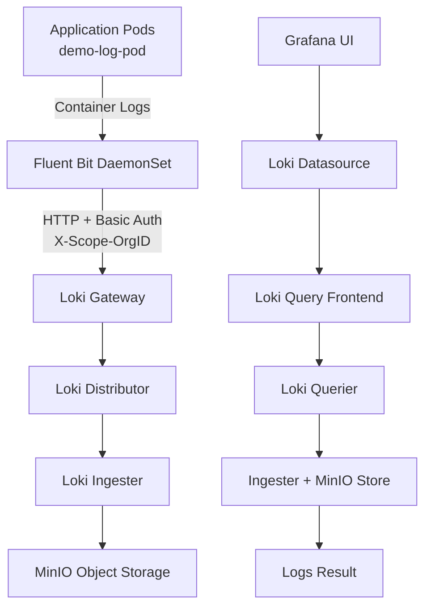
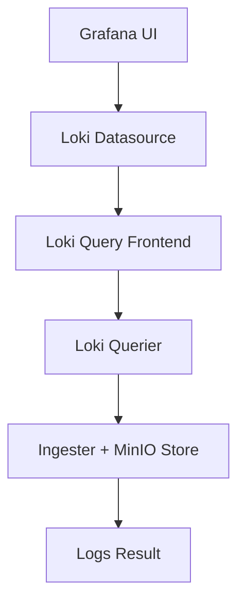

```mermaid
flowchart TD

    A[Application Pods<br/>demo-log-pod] -->|Container Logs| B[Fluent Bit DaemonSet]

    B -->|HTTP + Basic Auth<br/>X-Scope-OrgID| C[Loki Gateway]

    C --> D[Loki Distributor]

    D --> E[Loki Ingester]

    E --> F[MinIO Object Storage]

    %% Query Flow

    G[Grafana UI] --> H[Loki Datasource]

    H --> I[Loki Query Frontend]

    I --> J[Loki Querier]

    J --> K[Ingester + MinIO Store]

    K --> L[Logs Result]
```

```mermaid
flowchart TD


 G[Grafana UI] --> H[Loki Datasource]

    H --> I[Loki Query Frontend]

    I --> J[Loki Querier]

    J --> K[Ingester + MinIO Store]

    K --> L[Logs Result]
```
