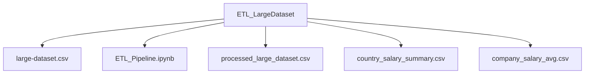

# ETL Pipeline for Large Dataset

This project demonstrates a **Python-based ETL (Extract, Transform, Load) pipeline** using **Pandas** and **NumPy** to process a CSV dataset and prepare it for analysis.

---

## Project Overview

The goal of this ETL pipeline is to:

1. **Extract**: Load a CSV dataset.
2. **Transform**: Clean and process the data.
3. **Load**: Save the processed data and aggregated summaries for further analysis.

---

## Dataset

The input dataset is `large-dataset.csv` with the following columns:

- `ID` – Unique identifier for each record  
- `Name` – Employee name  
- `Age` – Employee age  
- `Country` – Country of the employee  
- `Email` – Employee email  
- `Phone` – Contact number  
- `Address` – Employee address  
- `Company` – Company name  
- `DateJoined` – Joining date  
- `Salary` – Salary of the employee  

---

## ETL Steps 

### 1️⃣ Import Libraries
```python
import pandas as pd
import numpy as np
```

### 2️⃣ Extract - Load CSV
```python
df = pd.read_csv("large-dataset.csv")
print("Original Data Loaded")
print(df.head())
```

### 3️⃣ Transform Data

#### 3.1 Convert DateJoined to datetime
```python
df["DateJoined"] = pd.to_datetime(df["DateJoined"])
print("\n DateJoined converted to datetime")
print(df["DateJoined"].head())
```

#### 3.2 Uppercase categorical columns
```python
df["Name"] = df["Name"].str.upper()
df["Country"] = df["Country"].str.upper()
df["Company"] = df["Company"].str.upper()
print("\n Name, Country, Company converted to UPPERCASE")
print(df[["Name", "Country", "Company"]].head())
```

#### 3.3 Handle missing values
```python
df["Salary"] = df["Salary"].fillna(0)
df["Age"] = df["Age"].fillna(0)
df["Name"] = df["Name"].fillna("UNKNOWN")
df["Country"] = df["Country"].fillna("UNKNOWN")
df["Company"] = df["Company"].fillna("UNKNOWN")
df["Email"] = df["Email"].fillna("UNKNOWN")
df["Phone"] = df["Phone"].fillna("UNKNOWN")
df["Address"] = df["Address"].fillna("UNKNOWN")
print("\n Missing values handled")
print(df.head())
print("\nRemaining NaNs per column:\n", df.isnull().sum())
```

#### 3.4 Add calculated column
```python
df["SalaryPerYear"] = df["Salary"] / df["Age"]
print("\n Calculated column SalaryPerYear added")
print(df[["Salary", "Age", "SalaryPerYear"]].head())
```

#### 3.5 Filter / Subset example
```python
country1_df = df[df["Country"] == "COUNTRY_1"]
print("\n Filtered records for COUNTRY_1")
print(country1_df.head())
```

#### 3.6 Aggregate / Group by
```python
country_salary = df.groupby("Country")["Salary"].sum().reset_index()
company_salary_avg = df.groupby("Company")["Salary"].mean().reset_index()
print("\n Aggregated salary by Country")
print(country_salary.head())
print("\n Average salary by Company")
print(company_salary_avg.head())
```

### 4️⃣ Load - Save Transformed Data
```python
df.to_csv("processed_large_dataset.csv", index=False)
print("\n Full transformed data saved as processed_large_dataset.csv")

country_salary.to_csv("country_salary_summary.csv", index=False)
print(" Country salary summary saved as country_salary_summary.csv")

company_salary_avg.to_csv("company_salary_avg.csv", index=False)
print(" Company average salary saved as company_salary_avg.csv")
```

### 5️⃣ Quick Analysis Examples
```python
max_salary = df.loc[df["Salary"].idxmax()]
print("\n Max Salary Record:\n", max_salary)

print("\nAverage Salary:", df["Salary"].mean())
print("Total Salary:", df["Salary"].sum())
```

---
## Project Structure




## Tools & Libraries

- Python 3.x  
- Pandas  
- NumPy  
- Jupyter Notebook  

---

## Use Cases of This ETL Pipeline

1. **Data Cleaning & Standardization**  
   - Convert inconsistent formats (like dates, text casing) into standardized formats.  
   - Fill missing values in numeric and categorical columns to ensure data quality.  

2. **Data Transformation**  
   - Add calculated columns (e.g., `SalaryPerYear`).  
   - Aggregate data (e.g., total salary by country, average salary by company).  
   - Filter or subset data for specific analysis or reports.  

3. **Data Analysis Preparation**  
   - Prepare clean, structured datasets ready for reporting, visualization, or machine learning.  
   - Enable quick summary statistics for decision making.  

4. **Integration with Other Systems**  
   - Processed CSVs can be loaded into databases, BI tools, or dashboards.  
   - Enables smooth flow from raw data to actionable insights.  

5. **Automation of Repetitive Tasks**  
   - Reuse the pipeline for similar datasets, reducing manual effort and errors.  
   - Ideal for regularly updated datasets or scheduled data workflows.  

6. **Quality Assurance**  
   - Ensures data consistency, correctness, and completeness before analysis.  
   - Helps detect and correct anomalies early in the data lifecycle.

---

## Reference

You can use this video dataset as a reference for this project:  
[Google Drive Link](https://drive.google.com/file/d/1DHoiKo10T7CPbi5Vm5DNGAQ_IyKizMQ_/view?usp=drivesdk)

